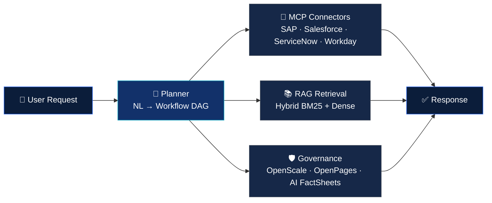

<div align="center">

# Chandan Kumar

### Lead Data Scientist @ IBM Lab — Agentic AI · GenAI · Enterprise MLOps


[](mailto:chandaniitismg@gmail.com)
[](https://www.linkedin.com/in/chandaniit)


</div>

<br/>

## 🚀 About Me

```yaml
Name:           Chandan Kumar
Title:          Lead Data Scientist @ IBM Lab
Location:       Bengaluru, India
Experience:     8+ years in AI/ML & Data Science
Education:      B.Tech, IIT (ISM) Dhanbad (2013 – 2017)
Background:     Super 30 Alumni
Focus:          Agentic AI · GenAI · LLMs · RAG · MLOps · Computer Vision
Currently:      Architecting agentic AI systems powering IBM Watsonx
                (Orchestrate, watsonx.ai, watsonx.governance, IBM Cloud)
Impact:         $4M+ verified business impact · 8 production deployments
                15+ enterprise AI/GenAI POCs across IBM, AWS, GCP & Azure
```

An **IIT graduate and Super 30 Alumni** with 8+ years of deep AI/ML & Data Science experience — currently Lead Data Scientist at **IBM Lab**, architecting agentic AI systems powering IBM Watsonx at global scale across Watsonx Orchestrate, watsonx.ai, watsonx.governance, and IBM Cloud.

Before IBM: led AI transformation at **Accenture** on AWS Bedrock & SageMaker; built mission-critical ML at Fortune 500 **Clean Harbors** on Azure ML & Azure Data Factory. Three platforms, three arenas, one through-line — **AI from whiteboard to measurable business outcome.**

Expert in `Python` · `GenAI` · `LLMs` · `Agentic AI` · `RAG` · `MLOps` · `Computer Vision` · `Deep Learning`, with **$4M+** in verified impact across **8** production deployments and **15+** enterprise AI & GenAI POCs spanning IBM, AWS, GCP & Azure.

<br/>

## 🧠 What I'm Building — IBM Watsonx Orchestrate (Weave)

The agentic AI lifecycle framework I lead core engineering on at IBM: natural-language requirements parsed into a workflow DAG → validated → deployed, with 60+ enterprise MCP connectors.



**10M+ daily API calls** · **p99 &lt;200ms** · **99.9% uptime** · **60+ enterprise MCP connectors** · **40% inference cost reduction**

<br/>

## 💼 Career Highlights

| Company | Role | Location | Period |
|---|---|---|---|
| **IBM Lab** | Lead Data Scientist | Bengaluru | Mar 2024 – Present |
| **Accenture** | Data Science Analyst — Strategy & Consulting | Gurugram | Apr 2021 – Feb 2024 |
| **Capgemini** | Analytics Process Lead | Bengaluru | Feb 2021 – Mar 2021 |
| **Clean Harbors** | Data Scientist — AI/ML Engineering | Hyderabad (India Tech Centre, Fortune 500 USA) | Jun 2018 – Jan 2021 |

<br/>

## 🏗️ Featured Systems

<details open>
<summary><b>🔷 IBM Lab — watsonx Orchestrate (Weave)</b> — Agentic AI Lifecycle Platform · IBM Product</summary>
<br/>

**Challenge:** No agentic AI framework existed at IBM — someone had to build it from scratch, own it end-to-end, and ship it before the market moved on.

**Contribution:** Led core engineering of the Weave framework — full Build → Validate → Deploy lifecycle: NL requirements parsed into workflow DAGs, automated agent & tool generation with conditional routing, and 60+ enterprise MCP connectors (SAP, Salesforce, ServiceNow, Workday) via OpenAPI transpilation with OAuth2/SAML.

**Impact:** Concept → production in `14 months` · `10M+` daily API calls · `p99 <200ms` · `99.9%` uptime · `$1.5M+` productivity gains · `40%` inference cost reduction · adopted as **IBM's reference multi-agent platform**.

`IBM Watsonx Orchestrate` `IBM Granite` `LangGraph` `AutoGen` `MCP` `OpenAPI` `OAuth2/SAML` `IBM Cloud OpenShift` `Kubernetes` `Redis` `OpenTelemetry` `Python`

</details>

<details>
<summary><b>🔷 IBM Lab — watsonx.governance</b> — Enterprise AI Risk & Compliance Platform · IBM Product</summary>
<br/>

**Challenge:** Hundreds of AI models in production with no governance — bias, drift, and regulatory breaches accumulating silently, undetected, unreported.

**Contribution:** Engineered an integrated GRC stack from the ground up — IBM OpenPages for policy-to-metric mapping and immutable audit trails; IBM OpenScale for real-time fairness, drift, and hallucination monitoring; AI FactSheets for machine-readable model provenance; a Governance Graph linking models, risk controls, and regulatory policies. Extended multi-cloud coverage to AWS SageMaker and Azure ML.

**Impact:** `1,000+` models under governed reuse · audit prep time weeks → hours · data review cycles `−58%` · `200+` regulatory frameworks mapped · designated IBM's **flagship compliance platform for EU AI Act readiness**.

`IBM watsonx.governance` `IBM OpenPages` `IBM OpenScale` `AI FactSheets` `AIF360` `SHAP/LIME` `EU AI Act` `NIST AI RMF` `ISO 42001` `AWS SageMaker` `Azure ML` `Python`

</details>

<details>
<summary><b>🏦 Accenture — ASK UB</b> — Intelligent Advisor Platform with HyDE-RAG · Client: Ulster Bank (NatWest Group)</summary>
<br/>

**Challenge:** Advisors were hallucinating on bank-specific policy — a liability, not a glitch, in a regulated bank. Compliance teams manually trawled 50K+ FCA/PRA documents for 4+ hrs/day.

**Contribution:** Domain-adapted a base LLM on Ulster Bank's proprietary corpus via LoRA fine-tuning on AWS SageMaker Training Jobs; served through AWS Bedrock with a downstream HyDE-RAG layer — hypothetical-answer generation to sharpen retrieval, then hybrid BM25 + dense vector search across 50K+ regulatory documents in Amazon OpenSearch, with citation-level attribution. Deployed serverlessly via AWS Lambda + API Gateway.

**Impact:** Advisor resolution time `−45%` · compliance query time `−70%` · responses under `500ms` · `zero` hallucination incidents and zero FCA/PRA violations · architecture reused across **3 additional Accenture engagements**.

`AWS Bedrock` `AWS SageMaker` `LoRA/PEFT` `HyDE-RAG` `BM25 + Dense Retrieval` `Amazon OpenSearch` `AWS Lambda` `AWS API Gateway` `Hugging Face Transformers` `LangChain` `Python`

</details>

<details>
<summary><b>📸 Accenture — Facebook BI</b> — Real-Time Content Moderation & Ad Relevance Platform · Client: Facebook</summary>
<br/>

**Challenge:** At Facebook's scale, a fractional drop in moderation recall means millions of policy-violating impressions live per day; existing pipelines couldn't triage petabyte-scale image streams in real time without sacrificing accuracy or cost.

**Contribution:** Architected a petabyte-scale real-time CV and ML inference platform using CNNs on PyTorch with AWS SageMaker, Glue, Redshift, and Ray in a multi-region active-active topology, processing 1B+ images daily at &lt;50ms latency. Built real-time feature store and ML pipelines with automated A/B testing and shadow deployments via AWS Step Functions.

**Impact:** Content moderation recall `+15%` · ad relevance `+12%` · processing latency `−60%` · model rollback incidents `−75%` · adopted as **Facebook's production reference architecture** for real-time vision inference at petabyte scale.

`PyTorch` `CNN` `AWS SageMaker` `AWS Glue` `Amazon Kinesis` `Amazon Redshift` `Ray` `AWS Step Functions` `A/B Testing` `Shadow Deployment` `Python`

</details>

<details>
<summary><b>☣️ Clean Harbors — Waste Classification Code System (WCC)</b> — EPA-Compliant Hazardous Waste ML System</summary>
<br/>

**Challenge:** A single misclassified waste stream triggers a federal EPA violation — every classification was made manually, by hand, every time, with no ML safeguard.

**Contribution:** Architected an end-to-end intelligent waste classification platform using a hybrid CNN + rule-based engine on Azure ML Studio, ingesting physical/chemical properties for full lifecycle regulatory code assignment. Designed synthetic data augmentation and SMOTE for extreme class imbalance; built an MLOps stack with automated drift detection and retraining via Azure Data Factory; integrated SHAP explainability; deployed as a REST API via Azure App Service with live Power BI dashboards.

**Impact:** `100%` manual classification eliminated · rare-category F1 `+28%` · misclassifications `−40%` · throughput `+22%` · `$500K` annual regulatory savings · **zero EPA violations** post-deployment.

`Azure ML Studio` `Hybrid CNN + Rule-Based Engine` `Azure Data Factory` `Azure App Service` `SMOTE` `SHAP` `Drift Detection` `REST API` `Power BI` `Python`

</details>

<details>
<summary><b>📊 Clean Harbors — Invoice Audit Automation & Revenue Protection</b> — Intelligent Billing Prediction Platform</summary>
<br/>

**Challenge:** Finance losing $750K+ a year to billing errors no one could see — every invoice hand-computed, every discrepancy hidden across thousands of service engagements.

**Contribution:** Developed an ML-powered invoice audit and anomaly detection system with multi-model ensembles and automated retraining on Azure ML Studio, SQL Database, and Data Factory — trained on 47 domain-engineered billing features to predict expected invoice totals and flag anomalous gaps. Integrated with the WCC platform via Azure Data Factory for closed-loop automation; surfaced executive dashboards in Power BI.

**Impact:** `80%` of audit workflows fully automated · prediction accuracy `>94%` sustained · `$750K` annual revenue protected · dispute resolution time `−50%` · false-positive flags `−35%`.

`Azure ML Studio` `Azure Data Factory` `Azure SQL Database` `Multi-Model Ensemble` `Gradient Boosting` `Feature Engineering` `Power BI` `Python` `SQL`

</details>

<br/>

## 🛠️ Tech Stack

**Agentic AI & LLMs**


**RAG & Knowledge Systems**


**LLM Fine-Tuning & Alignment**


**ML & Deep Learning**


**Cloud Platforms**


**Data & Engineering**


**MLOps & Governance**


<br/>

## 💡 Core Strengths

<table width="100%">
<tr>
<th align="center" width="25%">🤖 AI / ML Core</th>
<th align="center" width="25%">⚙️ Engineering & Infra</th>
<th align="center" width="25%">📈 Business & Strategy</th>
<th align="center" width="25%">🤝 Leadership</th>
</tr>
<tr>
<td align="center">Agentic AI Design</td>
<td align="center">Python (Expert)</td>
<td align="center">Stakeholder Management</td>
<td align="center">Technical Leadership</td>
</tr>
<tr>
<td align="center">LLM Fine-Tuning (LoRA/RLHF)</td>
<td align="center">MCP Server Design</td>
<td align="center">Enterprise POC Delivery</td>
<td align="center">Cross-Team Collaboration</td>
</tr>
<tr>
<td align="center">Enterprise RAG Architecture</td>
<td align="center">Kubernetes & Docker</td>
<td align="center">AI Governance & Compliance</td>
<td align="center">Executive Communication</td>
</tr>
<tr>
<td align="center">Model Evaluation & Guardrails</td>
<td align="center">Multi-Cloud (IBM/AWS/Azure)</td>
<td align="center">Regulatory Readiness (EU AI Act)</td>
<td align="center">Mentorship</td>
</tr>
<tr>
<td align="center">Computer Vision (CNN/ViT)</td>
<td align="center">API & OpenAPI Design</td>
<td align="center">ROI & Cost Optimization</td>
<td align="center">Problem Solving</td>
</tr>
</table>

<br/>

## 📜 Certifications & Badges

<table width="100%">
<tr>
<td align="center" width="33%">

🏛️<br/>**Northwestern University**<br/>Analytics & AI

</td>
<td align="center" width="33%">

🔷<br/>**IBM**<br/>AI Associate Data Scientist

</td>
<td align="center" width="33%">

🧠<br/>**Databricks Academy**<br/>Generative AI Fundamentals

</td>
</tr>
<tr>
<td align="center">

🔷<br/>**IBM**<br/>Solution Architect — Kubernetes & Cloud Paks

</td>
<td align="center">

🎓<br/>**Stanford University**<br/>Machine Learning

</td>
<td align="center">

🦜<br/>**LangChain Academy**<br/>LangGraph & LangSmith

</td>
</tr>
<tr>
<td align="center">

🟠<br/>**Anthropic**<br/>Model Context Protocol: Advanced Topics

</td>
<td align="center">

🤗<br/>**Hugging Face**<br/>AI Agents Fundamentals

</td>
<td align="center">

🔷<br/>**IBM**<br/>Trustworthy AI & AI Ethics

</td>
</tr>
<tr>
<td align="center">

🔷<br/>**IBM**<br/>Generative & Agentic AI Foundation

</td>
<td align="center">

🎓<br/>**Duke University**<br/>DevOps, DataOps, MLOps

</td>
<td align="center">

🔵<br/>**Microsoft**<br/>Azure Machine Learning

</td>
</tr>
</table>


<br/>

## 📊 GitHub Stats

<div align="center">


</div>

<br/>

## 📫 Let's Connect

<div align="center">

[](mailto:chandaniitismg@gmail.com)
[](https://www.linkedin.com/in/chandaniit)
[](https://chandankumariit.github.io/portfolio/cv_jun_updated.html)

</div>
